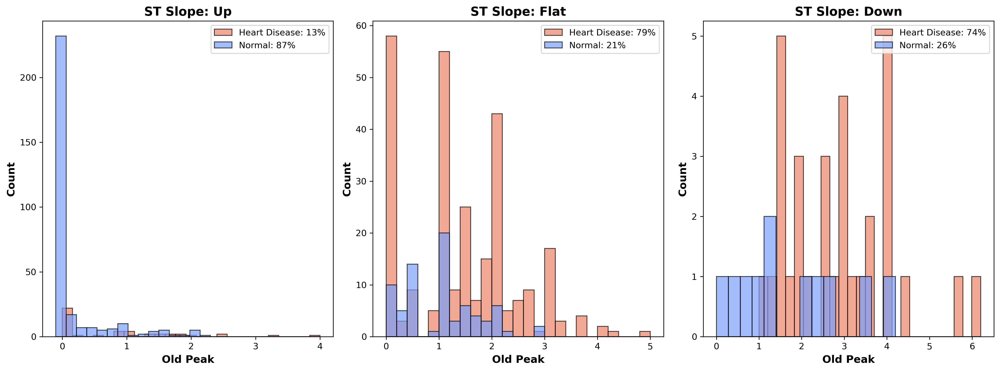

# Heart failure prediction model
DSI - Cohort 5 - Team 0 project
## Members:
 + Tatiana Uemura [link](https://github.com/midorikawaguti)
 + Evgenia Kveliashvili [link](https://github.com/ekveliasvili)
 + Aqib Khan [link](https://github.com/aqibkhan3)
 + Roslyn Bryan [link](https://github.com/RMB2025)

## Overview

This project explores the Heart Failure Prediction Dataset to predict the likelihood of heart failure based on clinical parameters. The aim is to showcase the power of data science in healthcare, enabling early interventions and reducing healthcare costs.

## Business case

Cardiovascular diseases (CVDs) remain a leading global health concern, with significant impacts on both mortality rates and economic stability.

According to the report provided by American Heart Association, CVD, listed as the underlying cause of death, accounted for 931,578 deaths in the United States in 2021. The economic burden of cardiovascular risk factors and overt cardiovascular disease is projected to increase substantially in the coming decades. Annual health care costs are projected to almost quadruple, from $393 billion to $1490 billion, and productivity losses are projected to increase by 54%, from $234 billion to $361 billion.
([Source](https://www.ahajournals.org/doi/10.1161/CIR.0000000000001258)) 

Early identification of individuals at risk of cardiovascular disease is crucial for reducing the financial strain on healthcare systems and improving preventive measures to manage this widespread condition. Preventive strategies should rely on screening for CVD risks in asymptomatic individuals. In this project we aim to determine factors(variables) that can predict CVD before the person with heart failure will be admitted in the hospital in life-thretening condition.

## Target audience
 + **Healthcare policy makers**  - to help them roll out preventive programs for early detection screenings, better allocate financial resources and implement targeted campaigns.
 + **Researchers** - to understand the impact of the different features on risk of heart disease.
 
## Project Methodology and Tasks
1. **Data Understanding**
    - *Task:* Analyze the downloaded dataset
    - *Methodology:* examine the structure of the dataset, types of variables, and quality issues, such as missing values (e.g. Cholesterol).
2. **Exploratory Data Analysis and Visualizations**
    - *Task:* Examine different visualizations to draw new insights
    - *Methodology:* Perform exploratory data analysis and create visualizations to explore the relationship between the feature and the target variable  (Presence or not of heart disease)
4. **Predictive Modeling**
   - *Task:* Build a machine learning classification model to predict heart failure.
   - *Methodology:*
     - Split the data into training and test sets, and experiment with different classification models (e.g., logistic regression and KNN classification).
     - Tune the model's hyperparameters and use cross-validation.
     - Evaluate the model using metrics, such as, accuracy, precision, recall, and F1-score.
6. **Insights and Feature importance Visualizations**
    - *Task:* Determine the features with biggest impact on predictions and visualize the insights.
    - *Methodology:* Analyze the model's predictions with SHAP values and visualizations to interpret the feature importance, and which contribute the most for        heart disease prediction.

## Dataset Overview
The dataset our team will be working on: [Heart Failure Prediction Dataset](https://www.kaggle.com/datasets/fedesoriano/heart-failure-prediction) from Kaggle.

This dataset contains combined data from 5 independent sources and has a total of 918 observations (after 272 duplicates had been deleted). There are 12 attributes in this dataset:
 #### Each row represents a single person:
- **`Age`** : age of the patient [years]
- **`Sex`** : sex of the patient [M: Male, F: Female]
- **`ChestPainType`** : chest pain type [
    TA: Typical Angina, or common heart related chest pain;
    ATA: Atypical Angina, or chest discomfort that does not fit any type of pain;
    NAP: Non-Anginal Pain, pain not related to heart;
    ASY: Asymptomatic, or lack of pain but not nessesarily absence of heart issues]
- **`RestingBP`** : resting blood pressure [mm Hg]
- **`Cholesterol`** : serum cholesterol [mm/dl]
- **`FastingBS`** : fasting blood sugar [1: if FastingBS > 120 mg/dl, 0: otherwise]
- **`RestingECG`** : resting electrocardiogram results [
    Normal: Normal, 
    ST: having ST-T wave abnormality (T wave inversions and/or ST elevation or depression of > 0.05 mV), 
    LVH: showing probable or definite left ventricular hypertrophy by Estes' criteria]
- **`MaxHR`** : maximum heart rate achieved [Numeric value between 60 and 202]
- **`ExerciseAngina`** : exercise-induced angina, or chest pain during physical activity [Y: Yes, N: No]
- **`Oldpeak`** : oldpeak = ST [Numeric value measured in depression] 
*ST depression refers to a finding on an electrocardiogram, wherein the* *trace in the ST segment is abnormally low below the baseline.*

- **`ST_Slope`** : the slope of the peak exercise ST segment [Up: upsloping, Flat: flat, Down: downsloping] from ECG readings
- **`HeartDisease`** : output class [1: heart disease, 0: Normal]

  

In order to execute the project we plan to use following libraries:
 + Numpy
 + pandas
 + matplotlib
 + sklearn
 + seaborn

## Data preprocessing

 + In order to understand the dataset we checked its basic structure and content.
 + Before performing any preprocessing, we reviewed the dataset to check for missing values. Ensuring data completeness is crucial for building reliable models or vizualizations. After inspecting the dataset, we confirmed that there were no missing values.
 + To ensure a consistent dataset, we checked if any columns had 0 values and if it did, whether 0 values were possible records. Only one column contained 0 values which we considered as wrong data. We replaced all occurrences of 0 (there are 172 records in dataset) in numerical column Cholesterol with the mean of that column.
 + In order to work with only numerical values we converted categorical variables into numerical format using one-hot encoding or label encoder, depending on the use case.

## Risks and unknowns
During internal discussion with the team we uncovered the following risks:
 + Column "Cholesterol" contains 0 values, and while rare genetic condirtions might cause cholesterol level be very low, it's extremely unlikely to be measured at 0. That means, that we need either to impute some values instead of 0 or delete 172 records from the dataset.If we choose to delete these records, we may risk losing valuable information, potentially affecting the robustness and accuracy of our analysis. On the other hand, imputing mean values comes with its own challenges, such as introducing bias or assumptions that may not accurately reflect the true distribution of cholesterol levels.

## Exploratory data analysis
 
 1. **Statistical summaries:**
 - **Average Age (Heart Disease):** 55.90 | Male: 55.87 | Female: 56.18
 - **Males with Heart Disease:** 90.16% | Females: 9.84%
 - **RestingBP: 134.19, Cholesterol:** 175.94, FastingBS: 0.33, MaxHR: 127.66
 - **Total Average:** 109.53
 - **RestingBP Contribution:** 122.51%
 - **Cholesterol Contribution:** 160.63%
 - **FastingBS Contribution:** 0.31%
 - **MaxHR Contribution:** 116.55%

  

  

*Observations:*

1.People in the 20-29 age group are less likely to have HeartDisease.
- 2.Cholesterol levels are higher in individuals with No HeartDisease compared to those with HeartDisease.
- 3.People without HeartDisease have higher MaxHR compared to those with HeartDisease.
- 4.Oldpeak values for people with HeartDisease are >0.9 in all population, whereas those without are <=0.8

2. **Correlation Heatmap**
    
  Analyze how features correlate to  each other. Darker and more intense colours represent stronger relationships(positive or negative). Neutral colours indicate weaker or no     
  relationships.

*Observations:*
1. **ST_Slope and Oldpeak (-0.50):**
   - A moderate negative correlation of -0.50 indicates that as ST_Slope decreases, Oldpeak tends to increase.
   - In medical terms, ST_Slope describes the slope of the ST segment in an ECG, and Oldpeak refers to ST depress relative to rest, often linked to heart stress or ischemia.
   - This negative correlation suggests that patients with more severe ST depression (higher Oldpeak) may also have downward or less favourable ST slopes.

2. **HeartDisease and ST_Slope (-0.56):**
   - The negative correlation of -0.56 is stronger, showing a more pronounced inverse relationship. As ST_Slope values decrease, the likelihood of HeartDisease increases.
   - In the medical field, certain ST slope patterns are considered significant indicators of heart disease. A flatter or downward slope is often linked to poorer heart function

### The visual representation of ST slope and St depression info from ECG readings

  

 + A scatterplot was constructed to investigate deeper the potential correlation between SL_Slope (representing the ST segment slope as recorded on an ECG) and Oldpeak (a numerical measurement indicating ST depression relative to rest). The scatterplot provides a visual representation of the relationship between these two variables, helping to identify patterns, trends, or potential linear associations.

  

  

 - We can see that a significant number of heart failure cases occur with ST_slope reading flat or down, also oldpeak values associated with heart disease are spread far from 0 values, with 0 values being more representative for healthy condition
 - This finding also support the fact that mild ST depression (less than 0.5 mm) is often considered a normal variant and may occur during physical exercise or in the absence of other abnormalities.
 - While significant ST depression (0.5 mm or more) can indicate myocardial ischemia (reduced blood flow to the heart muscle) and warrants further evaluation.*

3. **Shap Summary**

*Observations:*

## Conclusion

In conclusion, the exploratory data analysis revealed several critical insights into cardiovascular health indicators. The correlation heatmap highlighted significant relationships, such as the negative correlation between ST_Slope and HeartDisease (-0.56). Our findings show the importance of ST segment patterns and ST depression (Oldpeak) as potential predictors of heart disease, particularly in identifying more severe cases. The scatterplot and visualizations further emphasized the link between ST slope readings and heart disease, as well as the distribution of Oldpeak values, which tend to deviate from zero in individuals with heart disease. 

Statistical summaries revealed demographic trends, such as an average age of 55.90 for individuals with heart disease and a pronounced gender disparity, with males comprising 90.16% of cases. Additionally, other variables like cholesterol, MaxHR, and Oldpeak showed distinct differences between individuals with and without heart disease.

This project demonstrates the application of data science in healthcare. By combining exploratory analysis, predictive modeling, and visual storytelling, we can derive meaningful insights and inform early interventions for heart failure.
