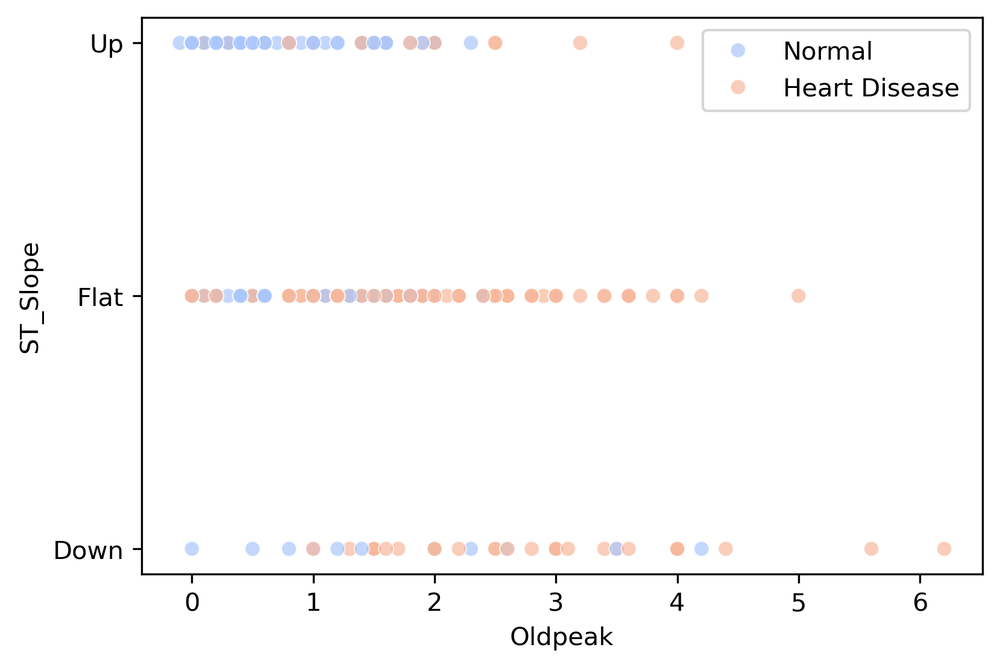

# Heart failure prediction model

DSI - Cohort 5 - Team 0 project

## Members:

- [Tatiana Kawaguti](https://github.com/midorikawaguti)
- [Evgenia Kveliashvili](https://github.com/ekveliasvili)
- [Aqib Khan](https://github.com/aqibkhan3)
- [Roslyn Bryan](https://github.com/RMB2025)

## Overview

This project explores the Heart Failure Prediction Dataset to predict the likelihood of heart failure based on clinical parameters. The aim is to showcase the power of data science in healthcare, enabling early interventions and reducing healthcare costs.

## Business case

Cardiovascular diseases (CVDs) remain a leading global health concern, with significant impacts on both mortality rates and economic stability.

According to the report provided by American Heart Association, CVD, listed as the underlying cause of death, accounted for 931,578 deaths in the United States in 2021. The economic burden of cardiovascular risk factors and overt cardiovascular disease is projected to increase substantially in the coming decades. Annual health care costs are projected to almost quadruple, from $393 billion to $1490 billion, and productivity losses are projected to increase by 54%, from $234 billion to $361 billion.
([Source](https://www.ahajournals.org/doi/10.1161/CIR.0000000000001258))

Early identification of individuals at risk of cardiovascular disease is crucial for reducing the financial strain on healthcare systems and improving preventive measures to manage this widespread condition. Preventive strategies should rely on screening for CVD risks in asymptomatic individuals. In this project we aim to determine factors(variables) that can predict CVD before the person with heart failure will be admitted in the hospital in life-thretening condition.

## Target audience

- **Healthcare policy makers** - to help them roll out preventive programs for early detection screenings, better allocate financial resources and implement targeted campaigns.
- **Researchers** - to understand the impact of the different features on potential risks of heart disease.

## Project Methodology and Tasks

1. **Data Understanding**
   - _Task:_ Analyze the downloaded dataset
   - _Methodology:_ examine the structure of the dataset, types of variables, and quality issues, such as missing values (e.g. Cholesterol).
2. **Exploratory Data Analysis and Visualizations**
   - _Task:_ Examine different visualizations to draw new insights
   - _Methodology:_ Perform exploratory data analysis and create visualizations to explore the relationship between the feature and the target variable (Presence or not of heart disease)
3. **Predictive Modeling**
   - _Task:_ Build a machine learning classification model to predict heart failure.
   - _Methodology:_
     - Split the data into training and test sets, and experiment with different classification models (e.g., logistic regression and KNN classification).
     - Tune the model's hyperparameters and use cross-validation.
     - Evaluate the model using metrics, such as, accuracy, precision, recall, and F1-score.
4. **Insights and Feature importance Visualizations**
   - _Task:_ Determine the features with biggest impact on predictions and visualize the insights.
   - _Methodology:_ Analyze the model's predictions with SHAP values and visualizations to interpret the feature importance, and which contribute the most for heart disease prediction.

## Dataset Overview

The dataset our team will be working on: [Heart Failure Prediction Dataset](https://www.kaggle.com/datasets/fedesoriano/heart-failure-prediction) from Kaggle.

This dataset contains combined data from 5 independent sources and has a total of 918 observations (after 272 duplicates had been deleted). There are 12 attributes in this dataset:

#### Each row represents a single person:

- **`Age`** : age of the patient [years]
- **`Sex`** : sex of the patient [M: Male, F: Female]
- **`ChestPainType`** : chest pain type [
  TA: Typical Angina, or common heart related chest pain;
  ATA: Atypical Angina, or chest discomfort that does not fit any type of pain;
  NAP: Non-Anginal Pain, pain not related to heart;
  ASY: Asymptomatic, or lack of pain but not nessesarily absence of heart issues]
- **`RestingBP`** : resting blood pressure [mm Hg]
- **`Cholesterol`** : serum cholesterol [mm/dl]
- **`FastingBS`** : fasting blood sugar [1: if FastingBS > 120 mg/dl, 0: otherwise]
- **`RestingECG`** : resting electrocardiogram results [
  Normal: Normal,
  ST: having ST-T wave abnormality (T wave inversions and/or ST elevation or depression of > 0.05 mV),
  LVH: showing probable or definite left ventricular hypertrophy by Estes' criteria]
- **`MaxHR`** : maximum heart rate achieved [Numeric value between 60 and 202]
- **`ExerciseAngina`** : exercise-induced angina, or chest pain during physical activity [Y: Yes, N: No]
- **`Oldpeak`** : oldpeak = ST [Numeric value measured in depression]
  _ST depression refers to a finding on an electrocardiogram, wherein the_ _trace in the ST segment is abnormally low below the baseline._
  
- **`ST_Slope`** : the slope of the peak exercise ST segment [Up: upsloping, Flat: flat, Down: downsloping] from ECG readings
- **`HeartDisease`** : output class [1: heart disease, 0: Normal]

<figure align="center">
  
   <figcaption><strong><em>Figure 1: Raw Data Overview</em></strong></figcaption>
</figure>

### **Observations**

### Demographic

- Age distribution seems to be normal with most people centered around 45-60 y.o
- There are more males than females in dataset, suggesting that we might need to consider stratification when building the predictive model.

### Clinical

- Most people have either asymptomatic or non-anginal pain which leads us to think that this particular features might not be a good indicator of heart failure risks.
- Cholesterol values at 0 is unrealistic, and as it has been previously adressed as possible risks/unknowns affecting the quality and precision of analysis.
- Fasting sugar level in most cases is 0 (means the values are below 120 mg/dL), possibly suggesting that it does not have strong correlation with heart disease diagnosis.
- Resting ESG records are predominately normal with significantly less cases of abnormal ST waves and left ventricular hypertrophy.
- Maximum Heart rate is normally distributed with some outliers.

### Exercise Related

- Almost evenly split value counts between people who experience exercise induced angina and those who do not.
- Distrubtion of OldPeak data confirmes that about 45% of the records have normal oldpeak values and about 55% of the records significantly skewed to the right.
- ST Slope values mainly split between Up and Flat categories and as these two categories are often associated with the heart disease, therefore are of big interest.
- Dataset contains 508 records of heart disease and 410 records of absense of heart disease.

## Libraries

In order to execute the project we plan to use following libraries:

- Numpy
- pandas
- matplotlib
- sklearn
- seaborn

## Data preprocessing

**Missing Values**

- In order to understand the dataset we checked its basic structure and content.
- Before performing any preprocessing, we reviewed the dataset to check for missing values. Ensuring data completeness is crucial for building reliable models or vizualizations. After inspecting the dataset, we confirmed that there were no missing values.

**Data Consistency**

- To ensure a consistent dataset, we checked if all columns and found that the Cholesterol variable contained 0 values, which is unlikely in a clinical context. Our approach was to drop all records with cholesterol = 0 (172 records in dataset, which means 18.7% of the dataset).
- This approach was chosen instead of imputing average cholesterol because doing so create a false representation of the data, as cholesterol levels are not uniformly distributed. This was confirmed by running the models, where imputing average cholesterol resulted in a worst scenario in terms of F1-score ( F1-Score for KNN Classification - Replacing with average: 0.82 | Dropping records : 0.84)
- Additionaly, we observed that 88% of records with cholesterol =0 were associated with heart disease. Keeping these values as zero or replacing them with the average cholesterol for Cholesterol > 0 (244.6 mm/dL) could affect the relationship between cholesterol and the occurence of heart disease, leading the model to identify misleading patterns. Notably, 244.6 mm/dL is below the average cholesterol for individuals with heart disease (251.06 mm/dL).

  **Data Standardization**

- In order to work with only numerical values we converted categorical variables into numerical format using one-hot encoding or label encoder, depending on the use case.

## Risks and Unknowns

During internal discussion with the team we uncovered the following risks:

- Column "Cholesterol" contains 0 values, and while rare genetic condirtions might cause cholesterol level be very low, it's extremely unlikely to be measured at 0. That means, that we need either to impute some values instead of 0 or delete 172 records from the dataset.If we choose to delete these records, we may risk losing valuable information, potentially affecting the robustness and accuracy of our analysis. On the other hand, imputing mean values comes with its own challenges, such as introducing bias or assumptions that may not accurately reflect the true distribution of cholesterol levels.

## Exploratory Data Analysis

The exploratory data analysis allow us to understand patterns and relationship in the data. We built visualizations of individual features, and correlation between features, and evaluated statistical summaries. This helps us to determine key features to focus on.

### 1. **Statistical Summary:**

- The following visualizations provide an overview of the data, to better understand the distribution, tendencies and variability.

<figure align="center">
  
   <figcaption><strong><em>Figure 2: Features Distributions Over Age</em></strong></figcaption>
</figure>    

<figure align="center">
  
   <figcaption><strong><em>Figure 3: Probability of Heart Disease for Categorical Features </em></strong></figcaption>
</figure>  

### _Observations:_

### Demographic Trends
 **`Age`**
- Older groups have more probability of heart disease. There is a 20% increase in the likelihood of heart disease when comparing individuals aged 50-59 to those in the 60-69 age group.
- People in the 20-29 age group are less likely to have HeartDisease. In the analyzed data set, there was no record of a patient with heart disease in this age group.
  
**`Gender`**
- The proportion of women (22%) who develop heart disease are lower than men (56%).

### Clinical

**`Cholesterol Levels`**
- Cholesterol levels are higher in individuals with heart disease aged 20-59, with similar averages across these groups.
- In the 60-79 age group, cholesterol is not a strong predictor, as those with heart disease have lower average cholesterol than those without. This suggests other factors may play a larger role in heart disease risk for older adults, such as age-related metabolic changes or the impact of cholesterol-lowering treatments.

**`Fasting Blood Sugar (FastingBS)`**
- Elevated fasting blood sugar levels (above 120 mg/dL) increase the likelihood of developing heart disease.
- In the data, high FastingBS levels are associated with a 65.6% probability of heart disease, while low levels correspond to a 44.1% probability.
- Although there is a difference in these probabilities, the fact that they are relatively close suggests that FastingBS alone may not be a strong predictor of heart disease risk.
  
**`Maximun Heart Rate (MaxHR)`**
- The average maxHR decreases across group ages.
-  Higher MaxHR is associated with lower likelihood of heart disease, decreasing with age.

**`Chest Pain`**
- 74% of people who have heart disease had asymptomatic chest pain (ASY), which means that routine check-ups are important for those with other risk factors.

**`ST Slope`**
- Most cases with Flat and Down ST_Slope are linked to heart disease (approximately 75% of the cases), while only 12.9% of individuals with an Up ST_Slope reported heart disease.
 
### Exercise related

**`Exercise Induced Angina`**
- Most individuals who experience angina during exercise  - 82.6% (Exercise Angina = 'Y') were diagnosed with heart disease. And vice versa, most people whithout angina during exercise are less likely to have it (25.9%).

**`Oldpeak (ST Depression)`**
- Oldpeak values greater than 0.9 are common in heart disease cases, while non-disease cases tend to have values ≤ 0.8.
- The higher the Oldpeak, the greater the likelihood of heart disease, with this trend becoming more pronounced as age increases.
  
---

#### While these initial insights reveal associations, they do not explain the relationships between features. To better understand how some variables interact, we examine correlations.

### 2. **Correlation Heatmap**

The correlation heatmap allows to analyze how features correlate to each other. Darker and more intense colours represent stronger relationships (positive or negative). Neutral colours indicate weaker or no relationships.

<figure align="center">
  
   <figcaption><strong><em>Figure 4: Correlation Heatmap</em></strong></figcaption>
</figure>  

### _Observations:_

**`Exercise Angina and ST_Slope (-0.47):`**

- The negative correlation of -0.47 indicates that higher oldpeak may provoke experience exercise-induced angina. 
   - _Oldpeak (ST segment depression)_: measures how much the heart’s electrical activity changes when a person exercises, which can indicate stress on the heart. 
   - _Exercise-Induced Angina_: refers to chest pain or discomfort caused by physical exertion, occurring when the heart does not receive enough oxygen.
- Correlation: If a person has high Oldpeak values, they are more likely to experience exercise-induced angina. According to figure 3, people with exercise-induce angina (Yes) are more likely to develop heart disease, 82.6%.

**`ST_Slope and Oldpeak (-0.61):`**

- A moderate negative correlation of -0.61 indicates that as ST_Slope decreases (moves from Up → Flat → Down), Oldpeak tends to increase.
    - _Oldpeak (ST segment depression)_: measures how much the heart’s electrical activity changes when a person exercises, which can indicate stress on the heart. A higher Oldpeak means more stress on the heart during exercise.
    - _ST_Slope_: shows whether the heart’s activity improves (Up), stays the same (Flat), or worsens (Down) during exercise.
- Correlation: The worse the heart’s response to exercise (high oldpeak), the more stress it shows on the Electrocardiogram (ECG) - often shows a Flat or Down ST_Slope, indicating potential heart problems.
  
  ---
#### Given the strong link between ST_Slope and Oldpeak, we further investigate their relationship through visualization.

<figure align="center">
  
   <figcaption><strong><em>Figure 5: Visual representation of ST slope and St depression (Oldpeak) info from ECG readings</em></strong></figcaption>
</figure>  

- The following plot was constructed to investigate deeper the potential correlation between ST_Slope and Oldpeak. It provides a visual representation of the relationship between these two variables, helping to identify potential associations.

<figure align="center">
  
   <figcaption><strong><em>Figure 6: ST_Slope vs OldPeak</em></strong></figcaption>
</figure>  

### _Observations:_

- Significant number of heart failure cases occur with ST_slope reading flat or down.
- Oldpeak values associated with heart disease are spread far from 0 values, with 0 values being more representative for healthy condition
- This finding also support the fact that mild ST depression - oldpeak (less than 0.5 mm) is often considered a normal variant and may occur during physical exercise or in the absence of other abnormalities.
- While significant ST depression (0.5 mm or more) can indicate myocardial ischemia (reduced blood flow to the heart muscle) and warrants further evaluation.

---

#### To quantify the features impact on model predictions, we analyze SHAP values.

### 3. **Shap Summary for Feature Importance**

To interpret the influence of each feature on the model's predictions, SHAP (SHapley Additive exPlanations) values were used to assess feature importance. SHAP values provide insights into how individual features contribute to the predicted likelihood of heart disease for each observation, offering a more interpretable breakdown of model decisions.

The SHAP values were calculated based on the results of a K-Nearest Neighbors (KNN) Classification model, with the following parameters and performance metrics:

| Model              | Params                             | Accuracy | Precision | Recall   | F1       |
| ------------------ | ---------------------------------- | -------- | --------- | -------- | -------- |
| KNN Classification | n_neighbors: 15, weights: distance | 0.855672 | 0.832539  | 0.862468 | 0.846944 |

The model was refitted using F1-score as the primary optimization metric. Since F1-score balances precision (minimizing false positives) and recall (minimizing false negatives), it is particularly great in health-related predictions, where both false alarms and missed diagnoses can have serious consequences.

<figure align="center">
  
   <figcaption><strong><em>Figure 7: Global Bar Plot - Shap Values</em></strong></figcaption>
</figure>  

<figure align="center">
  
   <figcaption><strong><em>Figure 8: Summary Shap Values</em></strong></figcaption>
</figure>  

### _Observations:_

These values reinforce most of what have been observed in the previous visualizations.

### Demographic Trends
**`Age`**: SHAP value: +0.04
 - Age has a moderate impact on heart disease predictions.
 - While younger individuals have a lower predicted risk, older age increases the predicted risk of heart disease.
- This trend is also visible in Figure 2, which illustrates heart disease probability across different age groups.

**`Gender`**: SHAP value: +0.03
- Gender has a moderate impact on heart disease predictions.
- Since the values were encoded, men are represented by 1 and women by 0.
- In Figure 8:
      -  Blue dots (lower SHAP values, representing women) are mostly on the left, indicating a lower risk of heart disease. 
      -  Red dots (higher SHAP values, representing men) are clustered around 0, suggesting that being men has little to no positive or negative impact on the prediction.

### Clinical

**`ST_Slope`** SHAP value: Up(+0.07) | Flat(+0.06)
- ST_Slope plays a significant role in heart disease predictions. A downward or flat ST slope often signals abnormal heart response during exercise, indicating higher risk.
- Encoding Explanation:
   ST_Slope_Up = 1 → Presence of an upward slope.
   ST_Slope_Flat = 1 → Presence of a flat slope.
   If both ST_Slope_Up = 0 and ST_Slope_Flat = 0, it implies a Downward ST slope (which is not explicitly encoded but inferred).

**`Max HR (Maximun Heart Rate)`** SHAP value: +0.06
- Lower peak heart rates during stress tests are linked to a higher likelihood of heart disease.
- This aligns with the medical understanding that a lower maximum heart rate during exercise may indicate cardiovascular limitations.

 ### Exercise related

**`Exercise Induced Angina`** SHAP value: +0.12
- It has a high impact on heart disease predictions.
- Since the values were encoded, ExerciseAngina_Y are represented by 1 and No by 0.
- In Figure 8:
      -  Blue dots (lower SHAP values, representing No) are clustered around 0, suggesting that 'No' Exercise Angina has little to no positive or negative impact on the prediction.
      -  Red dots (higher SHAP values, representing Yes) are mostly on the right, suggesting that being 'Yes' Exercise Angina has positive impact on the prediction.
- Exercise Angina strongly contributes to positive predictions.
- It aligns with the data in Figure 3, where 82.6% of individuals who experienced Exercise Angina were diagnosed with heart disease.
  
**`Oldpeak (ST depression)`** SHAP value: +0.14
-  Oldpeak emerges as a crucial predictor, confirming that individuals with significant ST depression on an ECG are highly likely to have heart disease.
- In Figure 8:
      -  Blue dots (lower SHAP values) are mostly on the left, meaning lower Oldpeak values decrease the predicted risk of heart disease.
      -  Red dots (higher SHAP values) are mostly spread to the right, suggesting that higher Oldpeak values have a strong positive impact on the prediction, increasing the likelihood of heart disease.
  

### 4. Conclusion

The exploratory data analysis revealed several critical insights into cardiovascular health indicators. This project aimed to determine the key factors that can predict heart disease before a life-threatening hospital admission occurs. We explored various demographic, clinical, and exercise-related features of heart disease. Our key findings include:

1. **Exercise Related**: SHAP value analysis highlighted exercise-related features as the most influential factors in predicting heart disease. Oldpeak (ST depression induced by exercise) and Exercise-Induced Angina ranked as the top two features in the global SHAP bar plot, with contributions of +0.14 and +0.12, respectively. This suggests that an individual’s heart response to exercise plays a crucial role in model predictions. The correlation heatmap (Figure 4) further reinforces this connection, showing a strong negative correlation (-0.61) between Oldpeak and ST segment response. Notably, among individuals reporting Exercise-Induced Angina, 82.6% were diagnosed with heart disease.

2. **Clinical**: Clinical factors also had a significant impact on heart disease predictions. Our findings highlight the importance of ST segment patterns and ST depression (Oldpeak) as potential indicators of disease severity. Figure 3 illustrates that Flat and Down ST_Slope patterns are associated with heart disease in approximately 75% of cases, whereas only 12.9% of individuals with an Up ST_Slope were diagnosed with the condition. The scatterplot (Figure 6) further emphasizes the relationship between ST slope readings and Oldpeak values, revealing a noticeable deviation from zero among heart disease patients.

3. **Demographic Features**:Demographic factors, while having a moderate impact on predictions, still played a role. As shown in Figure 2, the likelihood of heart disease increases with age. Additionally, while men were more frequently diagnosed with heart disease (56% among all mens in the dataset), women also exhibited a notable proportion (22% among all womens in the dataset).

This project demonstrates the power of data science in healthcare. By combining exploratory analysis, predictive modeling, and visual storytelling, we can extract meaningful insights to aid in early detection and intervention for heart disease, ultimately contributing to improved healthcare outcomes.
