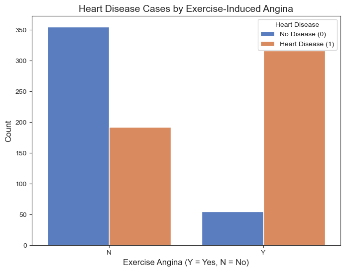

# Heart failure prediction model
DSI - Cohort 5 - Team 0 project
## Members:
 + Tatiana Uemura
 + Evgenia Kveliashvili
 + Aqib Khan
 + Roslyn Bryan

## Overview

This project explores the Heart Failure Prediction Dataset to predict the likelihood of heart failure based on clinical parameters. The aim is to showcase the power of data science in healthcare, enabling early interventions and reducing healthcare costs.

## Business case

Cardiovascular diseases (CVDs) remain a leading global health concern, with significant impacts on both mortality rates and economic stability.
According to the report provided by American Heart Association, CVD, listed as the underlying cause of death, accounted for 931,578 deaths in the United States in 2021. The economic burden of cardiovascular risk factors and overt cardiovascular disease is projected to increase substantially in the coming decades. Annual health care costs are projected to almost quadruple, from $393 billion to $1490 billion, and productivity losses are
projected to increase by 54%, from $234 billion to $361 billion.(https://www.ahajournals.org/doi/10.1161/CIR.0000000000001258)
Early detection of the people under cardiovascular risk can help to mitigate the financial burden on the healthcare system and improve preventive measures to manage this widespread condition. Preventive strategies should rely on screening for CVD risks in asymptomatic individuals. In this project we aim in determining factors(variables) that can predict CVD before the person with heart failure will be admitted in the hospital in life-thretening condition.

## Objective
Conduct exploratory data analyses, create visualization and build predictive model of demographic, clinical, and exercise-related features that are the most significant predictors of heart disease.

## Target audience
 + Healthcare policy makers  - to help them roll out preventive programs for early detection screenings, better allocate financial resources and implement targeted campaigns
 
## Methodology
1. Data Understanding
2. Exploratory Data Analysis
3. Predictive Modeling
4. Insights and Visualizations

## Project task
 + Analyze the downloaded dataset
 + Examine different visualizations to draw new insights
 + Build Machine Learning classification model to predict heart failure based on clinical, demographic and exersize-related features and determine what features have bigger impact on prediction

## Dataset review
The dataset our team will be working on:
https://www.kaggle.com/datasets/fedesoriano/heart-failure-prediction

This dataset contains combined data from 5 independent sources and has a total of 918 observations (after 272 duplicates had been deleted). There are 12 attributes in this dataset:
 #### Each row represents a single person:
- **`Age`** : age of the patient [years]
- **`Sex`** : sex of the patient [M: Male, F: Female]
- **`ChestPainType`** : chest pain type [TA: Typical Angina, ATA: Atypical Angina, NAP: Non-Anginal Pain, ASY: Asymptomatic]
- **`RestingBP`** : resting blood pressure [mm Hg]
- **`Cholesterol`** : serum cholesterol [mm/dl]
- **`FastingBS`** : fasting blood sugar [1: if FastingBS > 120 mg/dl, 0: otherwise]
- **`RestingECG`** : resting electrocardiogram results [Normal: Normal, ST: having ST-T wave abnormality (T wave inversions and/or ST elevation or depression of > 0.05 mV), LVH: showing probable or definite left ventricular hypertrophy by Estes' criteria]
- **`MaxHR`** : maximum heart rate achieved [Numeric value between 60 and 202]
- **`ExerciseAngina`** : exercise-induced angina [Y: Yes, N: No]
- **`Oldpeak`** : oldpeak = ST [Numeric value measured in depression]
- **`ST_Slope`** : the slope of the peak exercise ST segment [Up: upsloping, Flat: flat, Down: downsloping]
- **`HeartDisease`** : output class [1: heart disease, 0: Normal]

In order to execute the project we plan to use following libraries:
 + Numpy
 + pandas
 + matplotlib
 + sklearn
 + seaborn

## Data preprocessing
 + In order to understand the dataset we checked it's basic structure and content
 

<table border="1" class="dataframe">
  <thead>
    <tr style="text-align: right;">
      <th></th>
      <th>Age</th>
      <th>Sex</th>
      <th>ChestPainType</th>
      <th>RestingBP</th>
      <th>Cholesterol</th>
      <th>FastingBS</th>
      <th>RestingECG</th>
      <th>MaxHR</th>
      <th>ExerciseAngina</th>
      <th>Oldpeak</th>
      <th>ST_Slope</th>
      <th>HeartDisease</th>
    </tr>
  </thead>
  <tbody>
    <tr>
      <th>0</th>
      <td>40</td>
      <td>M</td>
      <td>ATA</td>
      <td>140</td>
      <td>289</td>
      <td>0</td>
      <td>Normal</td>
      <td>172</td>
      <td>N</td>
      <td>0.0</td>
      <td>Up</td>
      <td>0</td>
    </tr>
    <tr>
      <th>1</th>
      <td>49</td>
      <td>F</td>
      <td>NAP</td>
      <td>160</td>
      <td>180</td>
      <td>0</td>
      <td>Normal</td>
      <td>156</td>
      <td>N</td>
      <td>1.0</td>
      <td>Flat</td>
      <td>1</td>
    </tr>
    <tr>
      <th>2</th>
      <td>37</td>
      <td>M</td>
      <td>ATA</td>
      <td>130</td>
      <td>283</td>
      <td>0</td>
      <td>ST</td>
      <td>98</td>
      <td>N</td>
      <td>0.0</td>
      <td>Up</td>
      <td>0</td>
    </tr>
    <tr>
      <th>3</th>
      <td>48</td>
      <td>F</td>
      <td>ASY</td>
      <td>138</td>
      <td>214</td>
      <td>0</td>
      <td>Normal</td>
      <td>108</td>
      <td>Y</td>
      <td>1.5</td>
      <td>Flat</td>
      <td>1</td>
    </tr>
    <tr>
      <th>4</th>
      <td>54</td>
      <td>M</td>
      <td>NAP</td>
      <td>150</td>
      <td>195</td>
      <td>0</td>
      <td>Normal</td>
      <td>122</td>
      <td>N</td>
      <td>0.0</td>
      <td>Up</td>
      <td>0</td>
    </tr>
  </tbody>
</table>

The structure of our dataset:
<class 'pandas.core.frame.DataFrame'>
RangeIndex: 918 entries, 0 to 917
Data columns (total 12 columns):
 #   Column          Non-Null Count  Dtype  
---  ------          --------------  -----  
 0   Age             918 non-null    int64  
 1   Sex             918 non-null    object 
 2   ChestPainType   918 non-null    object 
 3   RestingBP       918 non-null    int64  
 4   Cholesterol     918 non-null    int64  
 5   FastingBS       918 non-null    int64  
 6   RestingECG      918 non-null    object 
 7   MaxHR           918 non-null    int64  
 8   ExerciseAngina  918 non-null    object 
 9   Oldpeak         918 non-null    float64
 10  ST_Slope        918 non-null    object 
 11  HeartDisease    918 non-null    int64  
dtypes: float64(1), int64(6), object(5)
memory usage: 86.2+ KB

 + Before performing any preprocessing, we reviewed the dataset to check for missing values. Ensuring data completeness is crucial for building reliable models or vizualizations. After inspecting the dataset, we confirmed that there are no missing values.
 + To ensure a consistent dataset, we checked if any columns have 0 values and if it does, whether 0 values are possible records. Only one column contained 0 values with we considered as wrong data. We replaced all occurrences of 0 (there are 172 records in dataset) in numerical column Cholesterol with the mean of that column.
 + In order to work with only numerical values we converted categorical variables into numerical format using one-hot encoding or label encoder, depending on the use case.

   
## Exploratory data analysis
 + Created correlation heatmap to analyze how features correlate to  each other. Darker and more intense colours represent stronger relationships(positive or negative). Neutral colours indicate weaker or no relationships.

*Analysis:
1. ST_Slope and Oldpeak (-0.50):

A moderate negative correlation of -0.50 indicates that as ST_Slope decreases, Oldpeak tends to increase.
In medical terms, ST_Slope describes the slope of the ST segment in an ECG, and Oldpeak refers to ST depress relative to rest, often linked to heart stress or ischemia. 
This negative correlation suggests that patients with more severe ST depression (higher Oldpeak) may also have downward or less favourable ST slopes.

2. HeartDisease and ST_Slope (-0.56):

The negative correlation of -0.56 is stronger, showing a more pronounced inverse relationship. As ST_Slope values decrease, the likelihood of HeartDisease increases.
In the medical field, certain ST slope patterns are considered significant indicators of heart disease. A flatter or downward slope is often linked to poorer heart function.*

 + A scatterplot was constructed to investigate deeper the potential correlation between SL_Slope (representing the ST segment slope as recorded on an ECG) and Oldpeak (a numerical measurement indicating ST depression relative to rest). The scatterplot provides a visual representation of the relationship between these two variables, helping to identify patterns, trends, or potential linear associations.

### The visual representation of ST slope and St depression info from ECG readings

*We can see that significant number of heart failure cases occur with ST_slope reading flat or down, also oldpeak values associated with heart disease are spread far from 0 values, with 0 values being more representative for healthy condition
This finding also support the fact that mild ST depression (less than 0.5 mm) isoften considered a normal variant and may occur during physical exercise or in the absence of other abnormalities. 
While significant ST depression (0.5 mm or more) can indicate myocardial ischemia (reduced blood flow to the heart muscle) and warrants further evaluation.*

 + Create statistical summaries and feature distributions
 + Build visualization of feature correlations to uncover relationships.

## Insights and visualizations

 + Early detection protocols focusing on high-risk individuals could sighnificantly improve patient outcomes.
 +

## Conclusion

This project demonstrates the application of data science in healthcare. By combining exploratory analysis, predictive modeling, and visual storytelling, we can derive meaningful insights and inform early interventions for heart failure.
